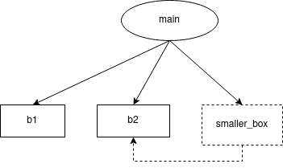
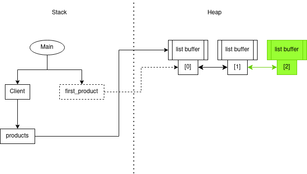

# 1 - Introduction aux graphes d’ownership

## B. Références

Code: https://godbolt.org/z/ra51avrKf

Question : Dans le graphe ci-dessus, pourquoi n’a-t-on pas représenté de relation entre
last_wheel et wheels[3] ?

    last_wheel est une copie de wheels[3], donc elles ne représentent pas la meme entitée.

Code: https://godbolt.org/z/n5eo1d8a1

Question : Dans le graphe d’ownership, comment sont représentés les pointeurs-nus ?
Comment est représenté un pointeur nul ? En terme de code, quelles sont les différences
principales entre un pointeur-nu et une référence ?

    Les pointeurs nus sont représentés comme des variables faisant refference à une autre variable.
    Les pointeurs nuls sont représentés par une variable faisant reférence à une croix.
    Pour utiliser un pointeur nu, il faut passer par addresses, alors qu'avec les references, on peut utiliser les valeurs directement.

Code: https://godbolt.org/z/Psaz31vYq

Pratique : Dessiner le graphe d’ownership correspondant au code ci-dessous. Vous pouvez
omettre de représenter les attributs size.

## C. Mémoire allouée sur le tas

Question : Pourquoi le second parent de June ne référence pas directement la case miguel_junior ?

    Parce que miguel_junior est un unique_ptr et sa valeur est stoquée dans le tas. Lors de l'appel à add_child_with, on donne donc la valeur du unique_ptr.

## D. Destructions

Question : A la suite de la destruction du contenu de miguel_junior, quel problème est mis en avant par le graphe d’ownership ?

    Le problème est que les références que l'on a faites sur la raférence de miguel_junior, ne sont plus valides.

## E. Movements

Question : Lorsqu’on écrit pokeball.pokemon = std::move(pikachu), est-ce que pikachu est déplacé ? Que se passe-t-il réellement dans la mémoire lors d’un move ?

    Pikachu ne faitr plus référence au pokemon buffer. Lorsque l'on fait un std:move, on change le pointeur qui fait reference à la valeur.

## F. Insertion dans un std::vector

Code: https://godbolt.org/z/fd7cvx5dz

Question : Quel problème apparaît dans le graphe ci-dessus ? Généralisez le problème et déduisez-en la série d’opérations qu’il ne faut pas faire lorsqu’on utilise un std::vector<T>.
Proposez des solutions qui permettent d’éviter le problème.

    first_product n'est plus valide. Il faut donc éviter toutes les opération pouvant causer une réalocation mémoire du vector.
    Pour palier à ce problème, on peut faire un vector<unique_ptr<T>>

Pratique : Au lieu d’utiliser des unique_ptr, redessinez la situation en passant par des std::list plutôt que par des std::vector.

Question : Est-ce que le problème décrit ci-dessus existe toujours ? Même question si vous aviez utilisé un std::set, un std::unordered_set, un std::map et un std::unordered_map.

    Le problème n'est plus d'actualité. avec un set, un unordered_set, un map ou un unordered_map, le problème n'apparait pas non plus.

# 2- Dessiner des graphes d’ownership

